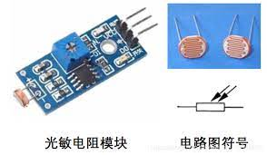
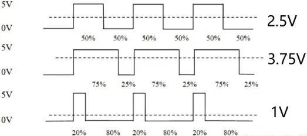

# Electrical Control Workshop

- [Electrical Control Workshop](#electrical-control-workshop)
  - [电路基本知识](#电路基本知识)
    - [1. 欧姆定律](#1-欧姆定律)
    - [2. 电阻电容电感](#2-电阻电容电感)
    - [3. 电源](#3-电源)
    - [4. 半导体](#4-半导体)
    - [5. 信号](#5-信号)
  - [嵌入式基本知识](#嵌入式基本知识)
    - [1. 什么是单片机，什么是SBC，与电脑区别](#1-什么是单片机什么是sbc与电脑区别)
    - [2. 有关嵌入式和硬件的重要知识](#2-有关嵌入式和硬件的重要知识)
    - [3. 外设](#3-外设)
  - [代码基本知识](#代码基本知识)
    - [1. c/cpp](#1-ccpp)
    - [2. micropython](#2-micropython)
  - [开发工具和环境](#开发工具和环境)
    - [1. Arduino IDE](#1-arduino-ide)
    - [2. VSCode + Platform IO](#2-vscode--platform-io)
    - [3. Clion + Platform IO](#3-clion--platform-io)
  - [传感器](#传感器)
    - [1. 传感器 与 传感器模块](#1-传感器-与-传感器模块)
    - [2. 常见传感器种类及使用](#2-常见传感器种类及使用)
  - [电机](#电机)
    - [什么是电机](#什么是电机)
      - [步进电机](#步进电机)
      - [舵机](#舵机)
      - [有刷/无刷电机](#有刷无刷电机)
    - [如何去控制一个电机 ~~这才是重点~~](#如何去控制一个电机-这才是重点)
        - [不太可行的方法:控制输入电机的电压](#不太可行的方法控制输入电机的电压)
        - [很可行的方法：PWM控制(占空比)](#很可行的方法pwm控制占空比)
        - [通过驱动模块来实现PWM控制](#通过驱动模块来实现pwm控制)
        - [舵机控制](#舵机控制)
  - [手柄输入](#手柄输入)
        - [接线](#接线)
        - [tips (from FAQ)](#tips-from-faq)
        - [代码实现](#代码实现)
  - [PID控制算法简介](#pid控制算法简介)
        - [P(比例) Control](#p比例-control)
        - [PI(积分) Control](#pi积分-control)
        - [PID(微分) Control](#pid微分-control)
  - [机器人框架](#机器人框架)
  - [demo](#demo)

----------

## 电路基本知识

### 1. 欧姆定律

`notice` *欧姆定律只适用于纯电阻电路，但是仍然可以帮助分析很多电路*

欧姆定律的标准式是 `I=U/R` ，通过这个式子我们能够获得更多更有用的式子，比如 `P=U^2/R = I^2*R`。以及更加重要的经验:"串联分压并联分流"  
在分析电阻的作用时，欧姆定律非常有用。

### 2. 电阻电容电感

notice *各种元件不可避免都具有一定的电阻电容电感，此处所指为电阻器，电容器，电感器*

1. 电阻
不同于初高中物理中的电阻，实际开发中我们不太会单独需要电阻来作为用电器消耗电能。
<details>
<summary>那么电阻可以用来干什么?</summary>
<code>
  上拉
  下拉
  分压
  和其他元件联动组成复杂电路
</code>
</details>

2. 电容
简单而言，电容是尽量保持电容两端的电压不变的元件
比如当电容与一个灯泡并联时，我们断开电源供电，如果没有电容电灯泡很快就会灭，但是有电容的情况下，电容会放电提供电能给电灯泡，也就是尽量保持电灯泡两端电压不下降。
`主要作用:滤波,耦合,降压,隔直,储能,旁路,谐波`

3. 电感
简单而言，电感是尽量保持通过电感的电流不变的元件。
比如当电感串联在电路中时，如果电流突然下降，则电感会提供额外的电流。
`主要作用:隔交,滤波,变压,储能`

### 3. 电源

1. 电池分类
  `此处不过多介绍一次性电池,比赛中不太会用到一次性电池`
   可充电电池:
    1. 铅酸电池—每个Cell的电压约2V，容量低但可输出较大的功率、电池，常使用于汽车中作启动引擎用，或用于不断电系统（UPS）、无线电机、通信机。
    2. 镍镉电池NiCd—电压约1.2V，有较强烈的记忆效应，而且容量较低，含有毒物质，对环境有害，现已被淘汰。
    3. 镍氢电池NiMH—电压约1.2V，有极轻微的记忆效应，容量较镍镉电池及碱性电池大，可充放电循环使用数百至二千几次。旧镍氢电池有较大的自放电，新的低自放电镍氢电池自放电低至与碱性电池相约，而且可在低温下使用（-20℃），充电装置、电压与镍镉电池相同，已取代了镍镉电池，同时也可取代绝大部分碱性电池的用途，也有用于混合动力车的。
    4. 锂离子电池Li-ion—电压约3.6V、3.7V，锂离子电池具有重量轻（容量是同重量的镍氢电池的1.5倍~2倍）、容量大、无记忆效应等优点，具有很低的自放电率，因而即使价格相对较高，仍然得到了普遍应用，包括许多电子产品，而且不含有毒物质，但这类用于消费性电子产品的Li-ion电池在存放一段时期后电量会永久减少。另也有用于纯电动车及混合动力车的Li-ion电池，用于这用途的锂离子电池容量相对略低，但有较大的输出、充电电流，也有的有较长的寿命，但成本较高。
    5. 磷酸铁锂电池，是一种使用磷酸铁锂（LiFePO4）作为正极材料，碳作为负极材料的锂离子电池，单体额定电压为3.2V，充电截止电压为3.6V~3.65V。磷酸铁锂电池具有工作电压高、能量密度大、循环寿命长、安全性能好、自放电率小、无记忆效应的优点。但是其绝对性能相较于锂电池有所下降

    总结: 建议选择锂离子电池

2. 一些有用的知识(此处就以锂电池为例)
   1. 锂电池容量
      mAh  Wh
   2. 锂电池常见型号
      18650   21600 --> 代表的是电池外观大小
   3. 动力电池性能
      几S电池:表示几节电池串联
      几C电池:表示放电倍率(不是电容量)   公式:  `最大电流(A) = C * Ah`  *比如20c 1000mAh电池的最大电流为 20A.*
   4. 电池组与平衡充电
      锂电池组通常是单串联，但是有时为了增加容量也可以同时并联和串联。  
      串联并联锂电池之前一定要保证电池之间性能相近，电压相近，建议使用全新满电同型号电池串联并联，且串联并联后不要改变电池组排列。  
      串联锂电池之后，充电需要考虑平衡问题。  
      一些动力电池不包含充电保护板，需要使用平衡充电器。其他电池组可能自带平衡充电板，不需要平衡充电器。  

### 4. 半导体

1. 二极管
   单项导通的元件，但是也不是完全单向导通，当反向电压足够大的时候可能会击穿
2. 三极管
   可控开关，控制电流
3. mos管
   可控开关，控制电压
   三极管比较便宜，用起来方便，常用在数字电路开关控制。 MOS管用于高频高速电路，大电流场合，以及对基极或漏极控制电流比较敏感的地方。 MOS管不仅可以做开关电路，也可以做模拟放大，因为栅极电压在一定范围内的变化会引起源漏间导通电阻的变化。

### 5. 信号

信号主要分为两大类，数字信号与模拟信号。

1. 数字信号
是指自变量是离散的、因变量也是离散的信号，这种信号的自变量用整数表示，因变量用有限数字中的一个数字来表示。在计算机中，数字信号的大小常用有限位的二进制数表示。  
绝大多数信号都是数字信号，比如开关的状态是开或关，对应1和0。计算机中数据也都是数字化的。

    > 优点：便于计算机处理，抗干扰性强。
    >
    > 缺点：丢失精度

2. 模拟信号
是指在时域上数学形式为连续函数的讯号。例如声波，是典型的模拟信号。  
现实中很多信号的形式是模拟的而非数字的，但是数字计算机不具有直接存储模拟信号的能力，因为数字是有限的而模拟信号理论上来说分辨率是无限的。  
比如一段音频文件，我们可以看到它具有一些属性：采样率、位深度等等。这些是模拟信号数字化的体现。  
本质上，存储在电脑里的音乐文件是数字化的，尽管声音通常是模拟信号。  

    > 优点：精度高，在特定情况下能解决数字系统无法解决的问题。
    >
    > 缺点：不论是存储，计算，转换都存在问题，容易混入噪声。

> 为什么要介绍这个?
>
> 不同于电脑上软件开发,基本只会接触数字信号. 两种类型的数据在嵌入式开发中都很常见. 比如一些传感器的返回值是模拟量(以电压高低),另一些传感器只有开关两种状态,或者采用数据总线

----------

## 嵌入式基本知识

### 1. 什么是单片机，什么是SBC，与电脑区别

1. 单片机

    > e.g. stm32,arduino,esp32等等


单片机也被称为单片微控器，属于一种集成式电路芯片。在单片机中主要包含CPU、只读存储器ROM和随机存储器RAM等，多样化数据采集与控制系统能够让单片机完成各项复杂的运算，无论是对运算符号进行控制，还是对系统下达运算指令都能通过单片机完成。 由此可见，单片机凭借着强大的数据处理技术和计算功能可以在智能电子设备中充分应用。简单地说，单片机就是一块芯片，这块芯片组成了一个系统，通过集成电路技术的应用，将数据运算与处理能力集成到芯片中，实现对数据的高速化处理。

2. 单板机（SBC）

    > e.g. 树莓派,香橙派,Jetson nano等等

单板机是把微型计算机的整个功能体系电路(CPU、ROM、RAM、输入/输出接口电路以及其他辅助电路）全部组装在一块印制电板上，再用印制电路将各个功能芯片连接起来。单板机一般而言性能要比单片机强很多,可以运行操作系统(比如 linux  andriod windows)
不严格的说,笔记本电脑的电路板拿出来也算单板机,但是一般而言SBC指代的是比较小的单板电脑.


3. 比较

单片机又称单片微控制器，它不是完成某一个逻辑功能的芯片，而是把一个计算机系统集成到一个芯片上。相当于一个微型的计算机，和计算机相比，单片机只缺少了I/O设备。概括的讲：一块芯片就成了一台计算机。它的体积小、质量轻、价格便宜、为学习、应用和开发提供了便利条件。

### 2. 有关嵌入式和硬件的重要知识

1. 电平
   将水和电作类比,电压和水压是类似概念,电流和水流的流速也是类似概念,那么电平和水平也可以理解为类似概念. 电平的概念和电压比较相似,但是我们常用高低电平来描述而非高低电压.就好比我们描述山上的湖泊的水平比海高一样,不会说湖的水压或者重力势能比海高.  
   `实际上我们有时候也会遇到负电压之类的问题`
2. 负逻辑
   开 != 高电平/高电压  
   关 != 低电平/低电压  
   不要简单理解为引脚输出高电压/高电平就是打开了一个东西,有时候逻辑是反过来的
3. 驱动隔离
   单片机的主控芯片驱动能力是很低的,除非必要,不要用它直接提供驱动电能  
   正确的做法是四两拨千斤,小电压控制大电压,驱动和控制要隔离  
4. 信号共地
   电压是相对的,在一块板子的0v可能在另一块板子上是5v,因此两块板子如果需要通信或者协同工作,一定要保证共地,也就是将两个板子的GND接到一起,保证有一个相同的参考电压

### 3. 外设


1. GPIO引脚
   GPIO（英语：General-purpose input/output），通用型之输入输出的简称，功能类似8051的P0—P3，其接脚可以供使用者由程控自由使用，PIN脚依现实考量可作为通用输入（GPI）或通用输出（GPO）或通用输入与输出（GPIO），如当clk generator, chip select等。
   既然一个引脚可以用于输入、输出或其他特殊功能，那么一定有寄存器用来选择这些功能。对于输入，一定可以通过读取某个寄存器来确定引脚电位的高低；对于输出，一定可以通过写入某个寄存器来让这个引脚输出高电位或者低电位；对于其他特殊功能，则有另外的寄存器来控制它们。
   
   输出模式：

   1. 推挽模式
   
   

   2. 开漏模式
   

   3. 比较和注意事项
   上拉电阻
   

   视频推荐 [推挽 开漏 高阻 这都是谁想出来的词？？](https://www.bilibili.com/video/BV1D84y1c7GV)
2. AD/DA转换
   模拟转数字和数字转模拟
   analog接口都是AD转换接口，而标有pwm接口的数字输出可以作为简单的DA转换
3. RTC
   RTC，英文是Real-time clock，翻译过来就是“实时时钟”，即单片机实时时钟，指可以像时钟一样输出实际时间的电子设备，一般为集成电路，因此也称为时钟芯片。RTC主要功能是为我们提供时间、日历及闹钟等与时间相关的服务。目前实时时钟芯片大多采用精度较高的晶体振荡器作为时钟源。
4. 定时器
   可以在单片机上设置，达到指定时间后触发中断   
5. 各种数据接口
   常见如UART、IIC、SPI、CAN等等


----------

## 代码基本知识

### 1. c/cpp

不同于几十年前在51单片机上使用汇编开发,和寄存器打交道,现代单片机开发大多数采用c/cpp语言.  
arduino不但有各种开发板,arduino本身也代表了一种标准,在创建项目的时候可以看到选用的是arduino框架.  
arduino虽然看起来使用 `.ino` 后缀,但本质是c/cpp  
c/cpp语言需要有 `main()` 函数入点,arduino似乎没有,但是实际上翻看源代码是找得到`main()`函数,而arduino框架封装好了,用户只需要定义 `setup()` 和 `loop()` 函数.  

### 2. micropython

很可惜,Atmel系列的芯片很少有支持micropython,确认此次材料包中的mega2560是不支持micropython

> *如果使用相对高级一些的mcu,例如stm32系列,esp32系列,rp2040,以及其他基于arm架构的mcu大多数都支持micropython.*

micropython是运行在嵌入式环境下的python解释器,能解释运行python代码,并且拥有嵌入式开发和硬件相关的库.

> 优点: "人生苦短我用python",python开发门槛相对于c/cpp低不少,而且因为其解释运行的特点,可以摆脱编译和烧写的过程
>
> 缺点: 性能开销较大,可能存在一些不稳定不兼容问题

----------

## 开发工具和环境

### 1. Arduino IDE

1. 安装[Arduino IDE](https://www.arduino.cc/en/software)（建议安装 ide 2）
2. 开箱即用，左上角可以指定开发板类型和串口端口号

> 优点：烧写代码相当方便，自带串口调试，开发板选型，代码示例，以及arduino第三方库
>
> 缺点：Arduino IDE代码功能相对简陋，启动慢，开发体验不是很好，默认.ino文件不方便项目管理

> tips:
> 可以在 `File - Preferences` 里面开启自动补全（比较下面位置的 Editor Quick Suggestions）

### 2. VSCode + Platform IO

1. 安装[vscode](https://code.visualstudio.com/)，[python](https://www.python.org/)
2. 安装c/c++，pio插件
3. 打开pio插件主页，新建项目（建立项目的时候需要科学上网）指定开发板类型，项目位置和名称等
4. 打开刚创建的项目，可以在底部看到验证（编译）、烧写、调试等功能

> 优点：可以使用大家熟悉的工具开发，vscode拥有的各种插件都可以使用，完整的c/cpp开发逻辑
>
> 缺点：需要配置环境、插件，platform IO相对臃肿，而且需要科学上网，第一次使用可能很难找到各种功能


> tips:
>  
> 1. 建议对pio插件采用只在某些工作区启用，不然你的vscode会很卡。
> 2. pio插件与clangd插件冲突，喜欢用clangd代码提示的建议在工作区内禁用clangd且启用c/c++插件（虽然intelli sense代码提示很蠢）
> 3. 然后执行项目任务“Miscelleneous -> Rebuild IntelliSense Index”。（可以直接`ctrl+shift+p`搜索）

### 3. Clion + Platform IO

1. 安装[clion](https://www.jetbrains.com/clion/)，pio插件（因为本人已经先用vscode装好pio了所以不确定clion是否需要另外安装pio）
2. 新建项目时选择嵌入式--PlatformIO，然后指定platformio.exe的路径。（建议添加到环境变量，否则后续步骤可能出问题）
3. 选择配置文件（此处我们使用mega2560，选择对应的配置就行）
4. 右上角可以指定配置，下载就选择下载，调试就选择调试（虽然两者分开很奇怪但是pio就是这样没办法）

> 优点：Clion代码开发体验极好
>
> 缺点：需要配置环境、插件，不习惯ide项目管理的同学可能不适应，库安装不太方便

----------

## 传感器

传感器（英文名称：transducer/sensor）是能感受到被测量的信息，并能将感受到的信息，按一定规律变换成为电信号或其他所需形式的信息输出，以满足信息的传输、处理、存储、显示、记录和控制等要求的检测装置。

### 1. 传感器 与 传感器模块

传感器可以由一个单独的元件组成,比如一个光敏电阻,一个压敏电阻,这些传感器往往需要外围电路
而传感器模块是封装好的,外围电路甚至芯片已经集成在一个模块中,用户使用只需要负责供电和数据交互



### 2. 常见传感器种类及使用

1. 测距传感器
测距传感器主要原理都是time of flight(tof),有通过声波传播(超声波传感器),光传播(红外线,激光测距)
2. 测力传感器
可以张力、拉力、压力、重量、扭矩、内应力和应变等力学量,按需使用
3. 其他传感器
   1. 湿度,红外等特殊用途传感器
   2. 编码器
   3. 陀螺仪,磁力计,imu等姿态传感器
   4. 遥控器从某些角度来说也属于传感器

----------

## 电机
### 什么是电机
从原理角度来看，~~能转的就是电机~~。
依据电磁感应定律实现电能转换或传递的一种电磁装置。

#### 步进电机

步进电机接收的是电脉冲信号，根据信号数量转过相应的步距角。通俗来讲就是你推一下，我动一下。动的角度就是步距角，是步进电机的固有属性。假如步距角是15°，表示每接收一个脉冲电机就转过15°。

所谓开环，就是只管控制，不管反馈。步进电机接收脉冲后转动，但不保证一定能转到。比如脉冲频率过高或者负载较大，就会造成失步，也就是没转到位。所以说使用步进电机的场合，要么不需要位置反馈，要么在其他设备上进行位置反馈。比如模型小车的车轮、光驱的光头、摄像机云台，以及各种行业机械设备等。步进电机一般长这样：


#### 舵机

从结构来分析，舵机包括一个小型直流电机，加上传感器、控制芯片、减速齿轮组，装进一体化外壳。

能够通过输入信号（一般都是是PWM信号，也有的是数字信号）控制旋转角度。廉价的方案就是一个电位器，通过电阻来检测，高级的方案则会用到霍尔传感器，或者光栅编码器。给模型用的舵机很多干脆就是塑料外壳加塑料齿轮组。~~但是这对于只有500报销额度的机械赛刚刚好~~

舵机的优势在于结构紧凑、**使用方便**、**价格便宜**的要求下，实现一定**位置**精度、负载能力及维持位置的能力，适合对控制性能要求不高、体积要求小的场合。
~~相信大家一定不想用有刷/无刷电机 + 编码器来控制~~


#### 有刷/无刷电机

有刷电机的主要结构就是定子+转子+电刷，通过旋转磁场获得转动力矩，从而输出动能。电刷与换向器不断接触摩擦，在转动中起到导电和换相作用。


无刷电机采取电流换向，线圈不动，磁极旋转。无刷电机，是使用一套电子设备，通过霍尔元件，感知永磁体磁极的位置，根据这种感知，使用电子线路，适时切换线圈中电流的方向，保证产生正确方向的磁力，来驱动电机。消除了有刷电机的缺点：电刷和换向器之间有摩擦，造成效率降低、噪音增加、容易发热、寿命降低。


不过最终就效果而言，有刷电机和无刷电机都是 通电->电机转动 的过程。

### 如何去控制一个电机 ~~这才是重点~~

以官方提供的不知名有刷电机为例


电机只有电源输入，将他直接连上电源已经开关，就成了一个只有两种开与关状态的电机。 ~~但显然这无法满足任何的需求~~

为了更好的控制电机的输出(转速/位置etc.) 我们需要控制电机的输入。

##### 不太可行的方法:控制输入电机的电压

~~不会真有人这么想吧，你电压和转速又不是线性关系~~

##### 很可行的方法：PWM控制(占空比)

PWM（Pulse Width Modulation）简称脉宽调制。

占空比指的是一个脉冲周期内，高电平的时间与整个周期时间的比例，单位是% (0%-100%)

一个周期的长度，如下图所示。



其中，周期是一个脉冲信号的时间，1s内的周期T次数等于频率f，脉宽时间是指高电平时间。

上图中，脉宽时间占总周期时间的比例，就是占空比。

比方说，周期的时间是10ms，脉宽时间是8ms，那么占空比是8/10= 80%，这就是占空比为80%的脉冲信号。

PWM就是脉冲宽度调制，通过调节占空比就可以调节脉冲宽度，最终来实现控制电机的转速。

##### 通过驱动模块来实现PWM控制

arduino的输出口无法提供足够大的电流，需要通过arduino控制电机驱动模块来间接控制电机

以官方提供的L298N为例


根据说明手册，我们可以得知


此时L298N~~相当于大号继电器~~可以通过逻辑上的输入IN1，IN2来控制电机的转与不转。

但是似乎和开关控制一模一样？

只用让这个开关像脉冲调制的形式一样开关不就行了

于是我们获得了


顺利的通过驱动模块来驱动我们的电机

##### 舵机控制

前文提到
>舵机能够通过输入信号（一般都是是PWM信号）控制旋转角度。

所以舵机并不需要像上面电机一样需要控制模块来对电源进行脉宽调制，而是直接输入PWM信号


· 一种典型的舵机输入


· 一种典型的PWM舵机控制方法

----------

## 手柄输入
~~难道看看官方说明文档不就好了吗~~

##### 接线
~~丝印是好文明~~
- Vcc 3v3和5V均可，可以直接从adruino上取电，如从电源取电，注意电机负载变化可能导致电压波动
- DAT，CMD，CS，CLK均接脉冲宽度调制，具体对应引脚可以在文件中更改宏定义
- 需要额外导入PS2X的lib库
  


##### tips (from FAQ)

- 第一次使用时需同时开机接收器和手柄进行匹配，当接收器RX常亮即已连接
- 当打开rumble时X键会有震动反馈，当然，比较难蚌
- 手柄亮灯模式下摇杆是模拟输出，不亮灯模式下摇杆推到底输出1
##### 代码实现


```
#include <PS2X_lib.h> //导入库
PS2X ps2x; //定义class
ps2x.config_gamepad(PS2_CLK, PS2_CMD, PS2_SEL, PS2_DAT, pressures, rumble); // init
ps2x.read_gamepad(false, vibrate);// read the data
ps2x.Button(PSB_L3) // true of false, check the button is pressed
```

演示部分见demo

----------

## PID控制算法简介

为什么需要闭环控制
·充分利用反馈
·提高控制精度
·降低外部扰动

PID控制器是非常经典的一种控制算法，是不需要知道系统的模型，仅仅根据期望与现状的偏差调节，使之能够到达期望的一种线性控制器。
优点：使用简单，灵活，调节方便，无模型。

由于不需要知道系统的模型，仅仅根据反馈量进行调节，新手能够很好地上手。

缺点：调节精度不高，不够精准

由于PID控制器是线性控制器，而现实中，大多是非线性的。用线性近似非线性，精度会有所下降。


##### P(比例) Control 

主要调节作用，可以加快调节，减小误差，存在稳态误差


##### PI(积分) Control

PI控制器，它添加与误差对时间积分成比例的项

I分量：
优点：减少静态误差，使曲线达到期望目标
缺点：增加调节时间，增大超调量


##### PID(微分) Control

PID控制器就是PI控制器加上与误差对时间的导数成比例的一项

D分量：
优点：减少调节时间，具有预见性，们可以预见偏差的变化趋势，产生超前的控制效果。

缺点：容易受到干扰，对噪声有放大作用，会减弱系统的抗干扰性。


·PID控制达到目标量

具体实现方法如有需要可以自行学习

----------

## 机器人框架

更好的实现功能->计时器/中断回调

使用外部库的一种实现案例

```cpp
#include <arduino-timer.h>

auto timer = timer_create_default();

bool handle() {
  Serial.print("2seconds\n");
  /*
    Write your code
  */
  return true;
}

void setup() {
  Serial.begin(57600);

  timer.every(2000, handle);
}

void loop() {
  timer.tick(); 
}
```

MSTimer2库

```cpp
#include <MSTimer2.h>

auto timer = timer_create_default();

void handle() {
  /*
    Write your code
  */
}

void setup() {
  Serial.begin(57600);

  MSTimer2::set(100,handle);
  MSTimer2::start();
}

void loop() {
}
```

----------

## demo

舵机驱动
``` cpp
#include <Servo.h>

Servo myservo;  // 定义Servo对象来控制
int pos = 0;    

void setup() {
  myservo.attach(2);  // 控制线连接数字2
}

void loop() {
  for (pos = 0; pos <= 90; pos ++) { // 0°到90°
    myservo.write(pos);       
    delay(5);       
  }
  for (pos = 90; pos >= 0; pos --) { // 从90°到0°
    myservo.write(pos);         
    delay(5); 
  }
}
```

PS2控制器 见示例代码

那么结合起来试一试？
